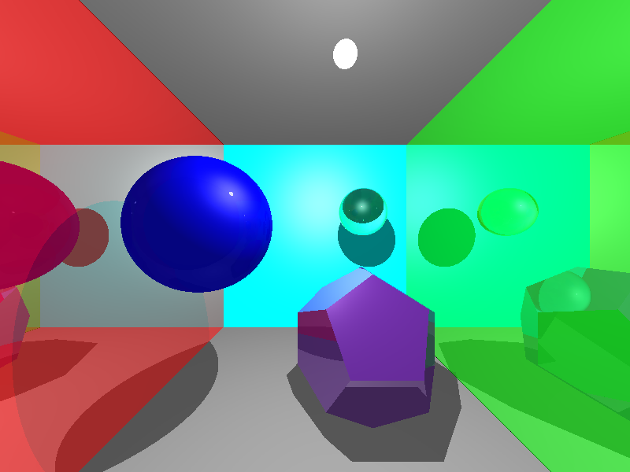
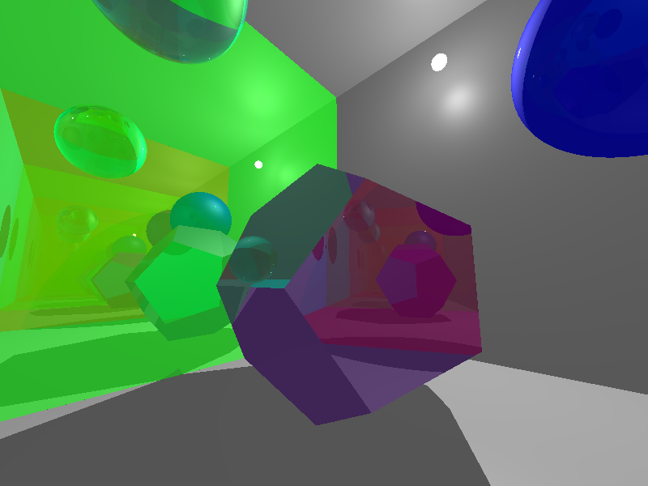
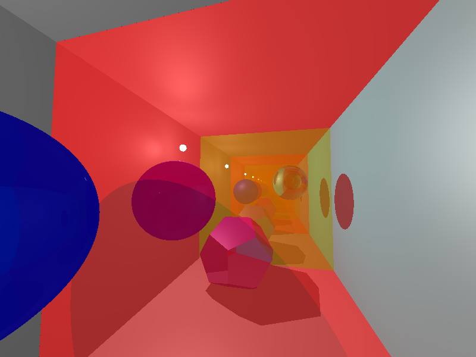
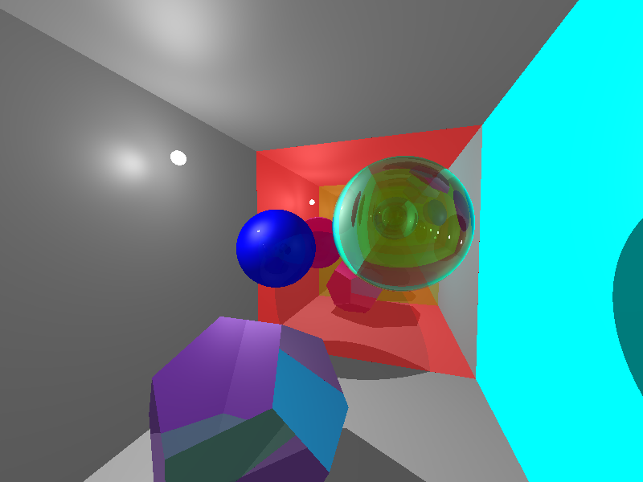
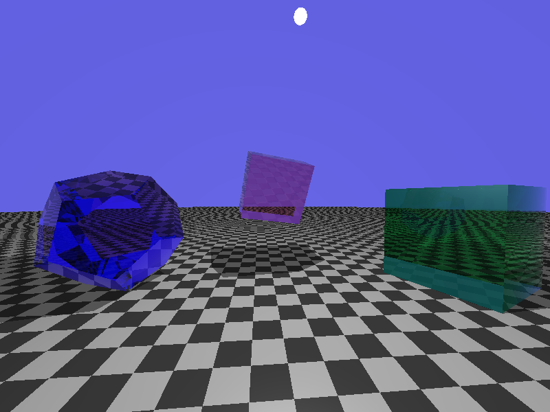
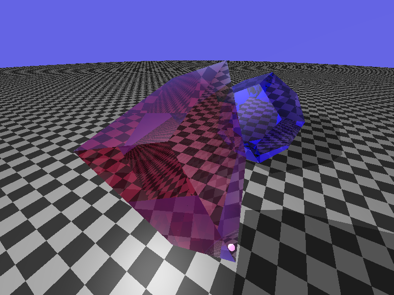
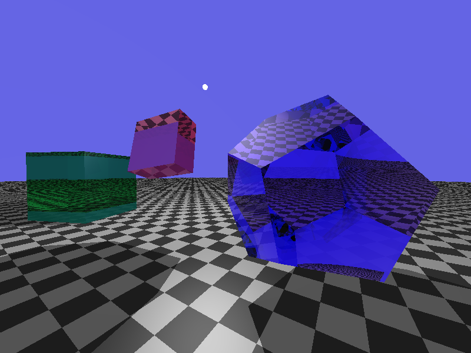
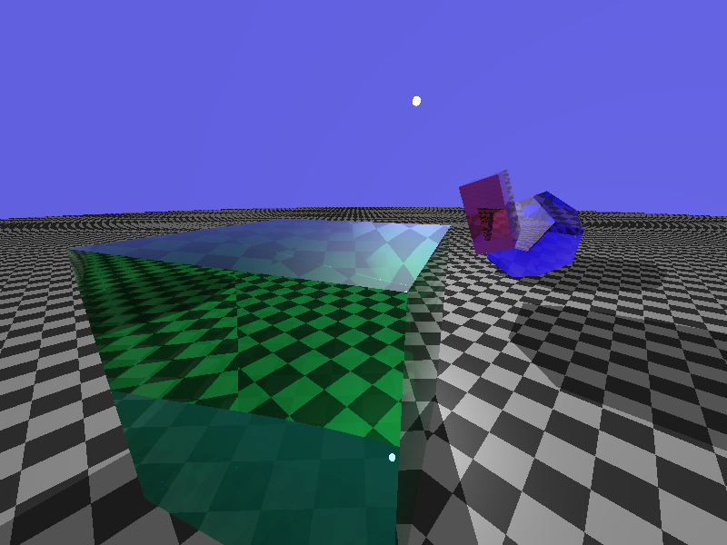

## ComputerGraphics Raytracing

Лабораторная работа по курсу компьютерной графики. Ray Tracing

Работу выполнили: [Damlrca](https://github.com/Damlrca), [Mortus19](https://github.com/Mortus19), [aartyomm](https://github.com/aartyomm)

С# + OpenGL (библотека OpenTK)  
Трассировка лучей с шейдингом по Фонгу (Phong shading). Стеклянные объекты основаны на формулах Френеля в виде аппроксимации Шлика (Fresnel, Schlick's approximation) и законе Бугера-Ламберта-Бера (Beer’s Law).  
Основная часть трассировки лучей написана во фрагментом шейдере.

Несколько скриншотов:

  
  
  
  
Сцена 1 (сцена по умолчанию), содержащая, в том числе, зеркальный филолетовый додекаэдр, прозрачную стеклянную сферу.

  
  
  
  
Сцена 2, содержащая набор стеклянных объектов.

**Управление**:
- `ESC` - Закрыть окно
- `1` - Сцена 1 (сцена по умолчанию), `2` - Сцена 2 
- `+` `-` - Изменение максимальной глубины рендеринга
- `W` `A` `S` `D` `SPACE` `SHIFT` - Управление положением камеры
- `UP` `DOWN` `LEFT` `RIGHT` - Управление направлением камеры
- `R` - Включить/Выключить автоматический поворот вокруг оси Y
