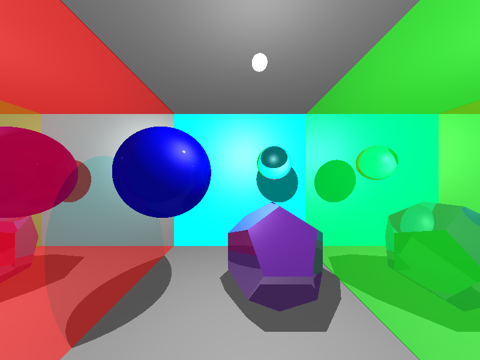
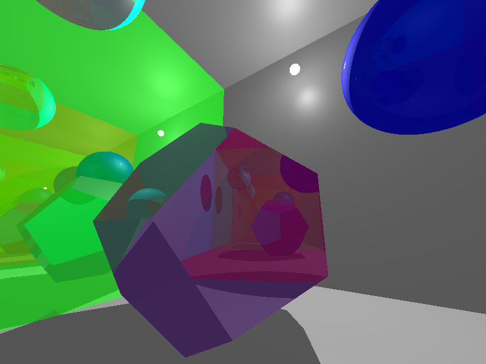
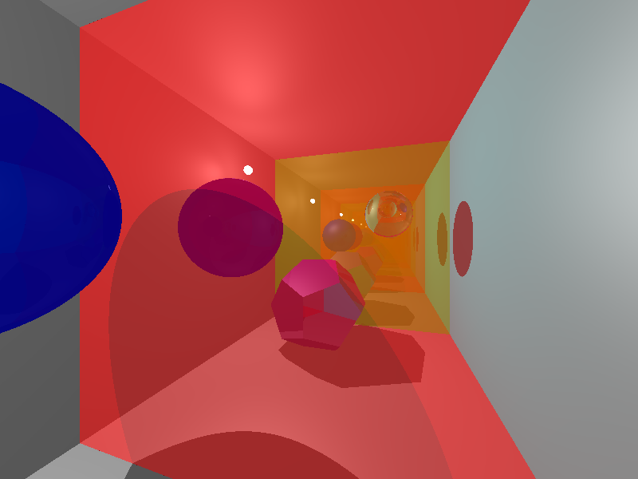
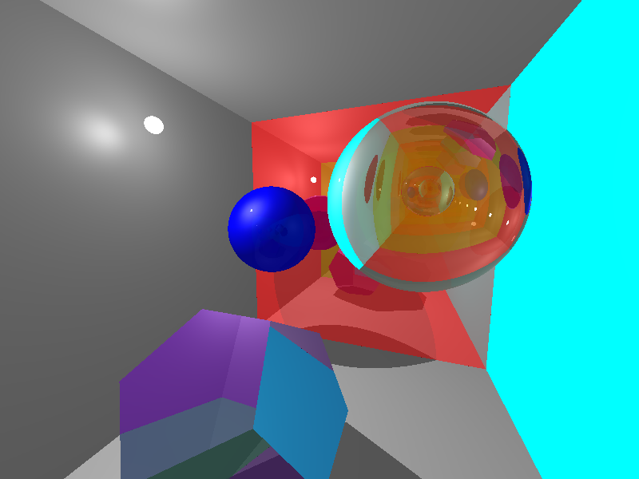

## ComputerGraphics Raytracing

Лабораторная работа по курсу компьютерной графики. Ray Tracing

Работу выполнили: [Damlrca](https://github.com/Damlrca), [Mortus19](https://github.com/Mortus19), [aartyomm](https://github.com/aartyomm)

С# + OpenGL (библотека OpenTK)  
Трассировка лучей с шейдингом по Фонгу.
Основная часть трассировки лучей написана во фрагментом шейдере.

Несколько скриншотов:

  
  
  
  
Базовая сцена, содержащая, в том числе, зеркальный филолетовый додекаэдр, прозрачную стеклянную сферу.

**Управление**:
- `ESC` - закрыть окно
- `+` `-` - изменение максимальной глубины рендеринга
- `W` `A` `S` `D` `SPACE` `SHIFT` - управление положением камеры
- `UP` `DOWN` `LEFT` `RIGHT` - управление направлением камеры
- `R` - включить/выключить автоматический поворот вокруг оси Y
